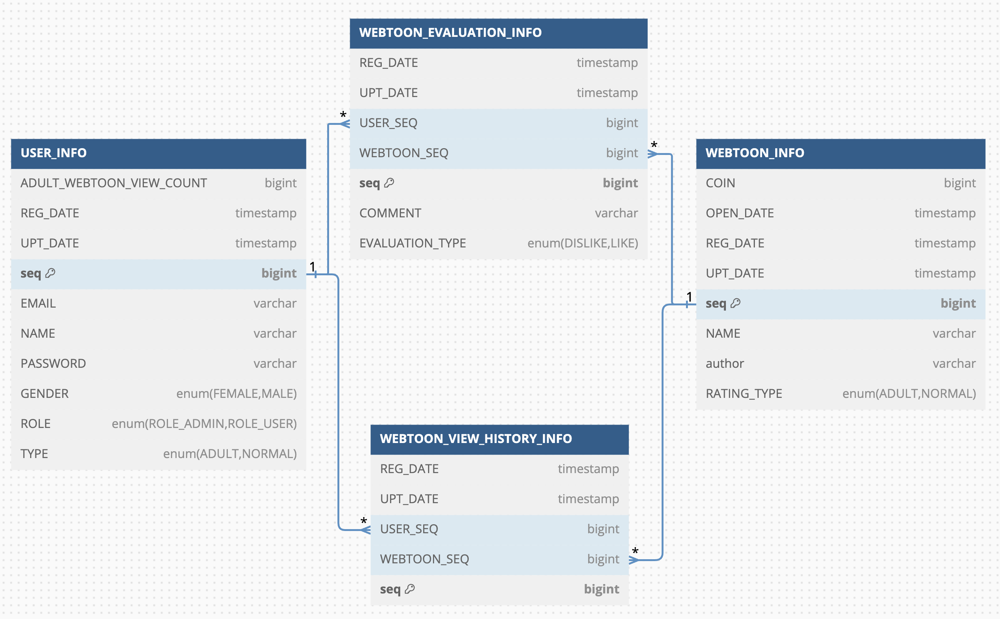
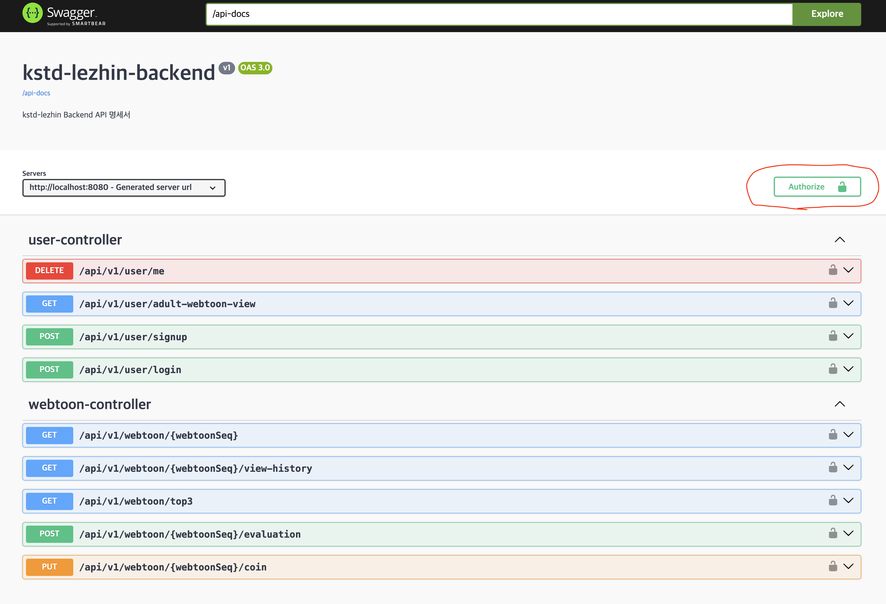

# 키다리/레진 백엔드 과제

- 사용 기술
    - Java 21
    - Spring Boot 3.3.2
    - Spring Security
    - Gradle 8.6
    - Spring Data JPA
    - QueryDSL
    - H2
- 테이블 설명
  
  - USER_INFO (회원 정보 테이블, UserEntity) 
  - WEBTOON_INFO (웹툰 정보 테이블, WebtoonEntity)
  - WEBTOON_EVALUATION_INFO (웹툰 평가 정보 테이블, WebtoonEvaluationEntity)
  - WEBTOON_VIEW_HISTORY_INFO (웹툰 조회 내역 테이블, WebtoonViewHistoryEntity)
- API 리스트
  - 회원 가입 API (`POST /api/v1/user/signup`)
    - name: 이름
    - email: 이메일
    - password: 비밀번호
    - role: 권한
      - ROLE_ADMIN: 관리자
      - ROLE_USER: 일반유저
    - gender: 성별
      - MALE: 남성
      - FEMALE: 여성
    - type: 회원 타입
      - NORMAL: 일반
      - ADULT: 성인
    - Request Body
      ```json
      {
        "name": "한규호",
        "email": "ghhan3@abc.com",
        "password": "ghhan12345",
        "role": "ROLE_ADMIN",
        "gender": "MALE",
        "type": "ADULT"
      } 
       ```
  - 토큰 발급 API (`POST /api/v1/user/login`)
    - email: 이메일
    - password: 비밀번호
    - Request Body
      ```json
      {
        "email": "ghhan3@abc.com",
        "password": "ghhan12345"
      }
      ```
  - 웹툰 평가 API (`POST /api/v1/webtoon/{webtoonSeq}/evaluation`)
    - evaluationType: 평가 타입
      - LIKE: 좋아요
      - DISLIKE: 싫어요
    - comment: 평가 코멘트 (optional, 특수문자 미허용)
    - Request Body
      ```json
      {
        "evaluationType": "LIKE",
        "comment": "좋아요.."
      }
      ```
  - 웹툰 좋아요 / 싫어요 TOP3 조회 API (`GET /api/v1/webtoon/top3`)
    - likeTop3List: 웹툰 좋아요 top3 리스트
      - seq: 웹툰 seq
      - count: 좋아요 카운트
      - name: 웹툰 명
      - author: 웹툰 저자 명
      - coin: 웹툰 금액
      - openDate: 웹툰 서비스 제공일
      - ratingType: 작품 심의 등급
        - NORMAL: 일반
        - ADULT: 성인
    - dislikeTop3List: 웹툰 싫어요 top3 리스트
      - seq: 웹툰 seq
      - count: 좋아요 카운트
      - name: 웹툰 명
      - author: 웹툰 저자 명
      - coin: 웹툰 금액
      - openDate: 웹툰 서비스 제공일
      - ratingType: 작품 심의 등급
        - NORMAL: 일반
        - ADULT: 성인
    - Response Body
    ```json
    {
      "likeTop3List": [
        {
          "seq": 1,
          "count": 1,
          "name": "웹툰1",
          "author": "홍길동1",
          "coin": 100,
          "openDate": "2024-08-08T03:30:31.067007",
          "ratingType": "NORMAL"
        },
        {
          "seq": 2,
          "count": 1,
          "name": "웹툰2",
          "author": "홍길동2",
          "coin": 1000,
          "openDate": "2024-08-08T03:30:31.068472",
          "ratingType": "NORMAL"
        },
        {
          "seq": 4,
          "count": 1,
          "name": "웹툰4",
          "author": "홍길동4",
          "coin": 1500,
          "openDate": "2024-08-08T03:30:31.06906",
          "ratingType": "ADULT"
        }
      ],
      "dislikeTop3List": [
        {
          "seq": 3,
          "count": 1,
          "name": "웹툰3",
          "author": "홍길동3",
          "coin": 500,
          "openDate": "2024-08-08T03:30:31.068769",
          "ratingType": "NORMAL"
        },
        {
          "seq": 5,
          "count": 1,
          "name": "웹툰5",
          "author": "홍길동5",
          "coin": 5000,
          "openDate": "2024-08-08T03:30:31.06938",
          "ratingType": "ADULT"
        },
        {
          "seq": 6,
          "count": 1,
          "name": "웹툰6",
          "author": "홍길동6",
          "coin": 10000,
          "openDate": "2024-08-08T03:30:31.069718",
          "ratingType": "ADULT"
        }
      ]
    }
    ```
  - 웹툰 조회 API (`GET /api/v1/webtoon/{webtoonSeq}`)
    - webtoonSeq: 웹툰 seq
    - Response Field
      - seq: 웹툰 seq
      - name: 웹툰 명
      - author: 웹툰 저자 명
      - coin: 웹툰 금액
      - openDate: 웹툰 오픈일
      - ratingType: 심의 등급
        - NORMAL: 일반
        - ADULT: 성인
    - Response Example
      ```json
      {
        "seq": 5,
        "name": "웹툰5",
        "author": "홍길동5",
        "coin": 5000,
        "openDate": "2024-08-08T15:44:49.647946",
        "ratingType": "ADULT"
      }
      ```
  - 웹툰 조회내역 조회 API (`GET /api/v1/webtoon/{webtoonSeq}/view-history`)
    - Path Param
      - webtoonSeq: 웹툰 seq
    - Query Params
      - page: 페이지 (0 부터 시작)
      - size: 페이지 당 사이즈 (최대 50)
      - direction: 시간 정렬 순서 (ASC or DESC)
    - Response Body
      ```json
      {
        "content": [
        {
          "userSeq": 1,
          "userName": "한규호",
          "userEmail": "ghhan3@abc.com",
          "gender": "MALE",
          "userType": "ADULT",
          "viewDateTime": "2024-08-08T15:48:38.404193"
        }
      ],
        "pageable": {
          "pageNumber": 0,
          "pageSize": 1,
          "sort": {
            "empty": false,
            "unsorted": false,
            "sorted": true
          },
          "offset": 0,
          "paged": true,
          "unpaged": false
      },
        "last": true,
        "totalElements": 1,
        "totalPages": 1,
        "sort": {
        "empty": false,
        "unsorted": false,
        "sorted": true
      },
        "size": 1,
        "number": 0,
        "first": true,
        "numberOfElements": 1,
        "empty": false
      }
      ```
  - 웹툰 금액 변경 API (관리자용) (`PUT /api/v1/webtoon/{webtoonSeq}/coin`)
    - Path Param
      - webtoonSeq: 금액을 변경하고자하는 웹툰 seq
    - Request Body
      - coin: 금액
    - Request Example
      ```json
      {
        "coin": 100
      }
      ```
  - 최근 일주일 등록 사용자 중 성인작품 3개 이상 조회한 사용자 목록 조회 API (관리자용) (`GET /api/v1/user/adult-webtoon-view`)
    - Query Params
      - page: 페이지 (0 부터 시작)
      - size: 페이지 당 사이즈 (최대 50)
      - direction: 유저 등록일 기준 정렬 순서 (ASC or DESC)
    - Response Body
      - userSeq: 유저 seq
      - userName: 유저 명
      - userEmail: 유저 이메일
      - gender: 성별 (MALE or FEMALE)
      - userType: 유저 타입
      - viewCount: 성인 작품 조회 카운트
    - Response Example
      ```json
      {
        "content": [
        {
          "userSeq": 1,
          "userName": "한규호",
          "userEmail": "ghhan3@abc.com",
          "gender": "MALE",
          "userType": "ADULT",
          "viewCount": 3
        }
      ],
        "pageable": {
          "pageNumber": 0,
          "pageSize": 6,
          "sort": {
            "empty": false,
            "unsorted": false,
            "sorted": true
          },
          "offset": 0,
          "paged": true,
          "unpaged": false
        },
        "last": true,
        "totalElements": 1,
        "totalPages": 1,
        "sort": {
          "empty": false,
          "unsorted": false,
          "sorted": true
        },
        "size": 6,
        "number": 0,
        "first": true,
        "numberOfElements": 1,
        "empty": false
      }
      ```
  - 회원 탈퇴 API (`DELETE /api/v1/user/me`)
- API 실행방법
  - API는 swagger 또는 http file에서 사용 가능합니다.
    - swagger: http://localhost:8080/swagger.html
    - http file
      - user.http
      - webtoon.http
  - user.http 파일에서 회원가입 API 사용 후 토큰 발급 API를 사용하면 토큰이 자동으로 설정되어서 API 사용이 가능합니다.
  - swagger에서는 토큰발급 후 토큰을 설정한 후에 API 사용이 가능합니다.
  - 
- 개발 내용 상세 설명
  - 기본적으로 회원가입 후 토큰을 발급받아야 API 사용이 가능하도록 구현하였습니다. (토큰 만료시간: 1일)
  - 편의 상 서버 기동 시 기본적인 웹툰 정보를 미리 INSERT 하도록 구현하였습니다. (data.sql)
    ```sql
    INSERT INTO WEBTOON_INFO (NAME, AUTHOR, RATING_TYPE, COIN, OPEN_DATE, REG_DATE, UPT_DATE)
      VALUES ('웹툰1', '홍길동1', 'NORMAL', 100, now(), now(), now());
    INSERT INTO WEBTOON_INFO (NAME, AUTHOR, RATING_TYPE, COIN, OPEN_DATE, REG_DATE, UPT_DATE)
      VALUES ('웹툰2', '홍길동2', 'NORMAL', 1000, now(), now(), now());
    INSERT INTO WEBTOON_INFO (NAME, AUTHOR, RATING_TYPE, COIN, OPEN_DATE, REG_DATE, UPT_DATE)
      VALUES ('웹툰3', '홍길동3', 'NORMAL', 500, now(), now(), now());
    INSERT INTO WEBTOON_INFO (NAME, AUTHOR, RATING_TYPE, COIN, OPEN_DATE, REG_DATE, UPT_DATE)
      VALUES ('웹툰4', '홍길동4', 'ADULT', 1500, now(), now(), now());
    INSERT INTO WEBTOON_INFO (NAME, AUTHOR, RATING_TYPE, COIN, OPEN_DATE, REG_DATE, UPT_DATE)
      VALUES ('웹툰5', '홍길동5', 'ADULT', 5000, now(), now(), now());
    INSERT INTO WEBTOON_INFO (NAME, AUTHOR, RATING_TYPE, COIN, OPEN_DATE, REG_DATE, UPT_DATE)
      VALUES ('웹툰6', '홍길동6', 'ADULT', 10000, now(), now(), now());
    ```
  - 아래 두 API는 관리자만 접근하는 것이 적합해보여서 ROLE_ADMIN 유저만 접근가능 하도록 개발했습니다.
    - PUT /api/v1/webtoon/{webtoonSeq}/coin (작품 금액 변경)
    - GET /api/v1/user/adult-webtoon-view (최근 일주일 등록 사용자 중 성인작품 3개 이상 조회한 사용자 목록 조회)
  - 아래 두 API는 페이징 처리를 하여 구현하였습니다.
    - GET /api/v1/user/adult-webtoon-view (최근 일주일 등록 사용자 중 성인작품 3개 이상 조회한 사용자 목록 조회)
    - GET /api/v1/webtoon/{webtoonSeq}/view-history (웹툰 조회내역 조회)
  - 웹툰 조회 API를 사용하면 조회내역 데이터가 쌓이도록 구현하였습니다.
  - 회원 탈퇴 API (DELETE /api/v1/user/me) 에서 회원정보, 평가이력, 조회내역 모두 삭제되도록 구현하였습니다.
  - USER_INFO 테이블에 ADULT_WEBTOON_VIEW_COUNT 컬럼을 생성하여 해당 유저가 성인작품을 조회할 때 마다 카운트가 증가하도록 개발하였습니다.
    - 그로 인해 조회 내역 테이블(WEBTOON_VIEW_HISTORY_INFO)을 매번 group by 할 필요 없이 USER_INFO 테이블만 참조해도 해당 내역을 조회할 수 있도록 하였습니다. (조회 성능 향상 기대)
  - 웹툰작품 평가 요청 시 댓글에 특수문자를 허용하지 않도록 Custom Validator을 사용하였습니다.(~과 !는 허용) (WebtoonCommentValidator.java) 
    - 각 필드의 조건이 만족하지 않는 경우에 대한 에러 형태는 아래와 같습니다.
      ```json
        {
        "errorCode": "SCHEMA_VALIDATE_ERROR",
        "message": "요청 필드에 대한 검증에 실패하였습니다.",
        "errorFields": [
          {
            "fieldName": "comment",
            "message": "웹툰 평가 코멘트는 특수문자를 허용하지 않습니다."
          },
          {
            "fieldName": "evaluationType",
            "message": "널이어서는 안됩니다"
          }
        ]
      }
      ```
  - Entity의 연관관계는 다대일 관계(ManyToOne)만을 사용하여 구현하였습니다.